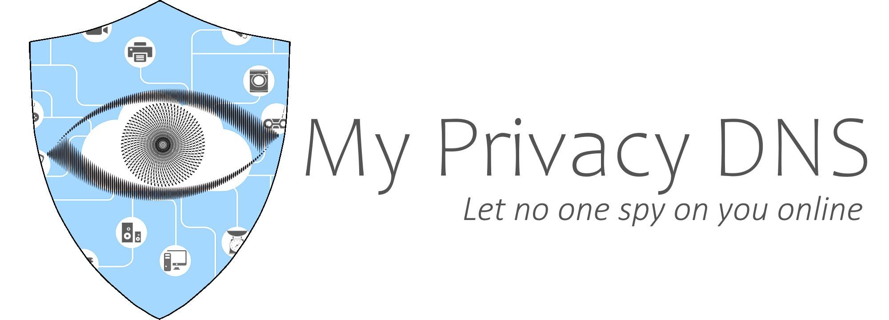

# The Matrix

[My Privacy DNS](https://mypdns.org/)' "Matrix" project is
a handcrafted and completely self-managed DNS Firewall through Response
Policy Zones (RPZ).

The project aims to protect your privacy by blocking access to malicious
domains and tracking servers to help you stay safe and secure.
With the rise of online tracking and data breaches, it's more important
than ever to take steps to protect your privacy online.

One of these features is the anti-porn (anti-NSFW) list, which blocks access
to pornographic and explicit sites.
This feature is especially useful for parents who want to ensure that their
children are not exposed to inappropriate content online.

## TOC

- [The Matrix](#the-matrix)
  - [TOC](#toc)
  - [Donations](#donations)
  - [Source list](#source-list)
  - [Categorizing](#categorizing)
  - [Submitting](#submitting)
  - [Combining the Matrix](#combining-the-matrix)
  - [Whitelist](#whitelist)
  - [Bulk commits](#bulk-commits)
  - [FAQ](#faq)
    - [Broken site](#broken-site)
    - [Why not Whitelisting](#why-not-whitelisting)
  - [Sponsors](#sponsors)
  - [Official mirrors](#official-mirrors)
  - [Project Keywords](#project-keywords)

## Donations

My Privacy DNS is an excellent way to protect your privacy online, and it also
offers additional features to help you stay safe and secure. One of these
features is the anti-porn list, which blocks access to pornographic and
explicit sites.
This feature is especially useful for parents who want to ensure that their
children are not exposed to inappropriate content online.

With the rise of online tracking and data breaches, it's become more important
than ever to take steps to protect your privacy online.
My Privacy DNS is a great way to do just that. It's easy to use, highly
effective, and completely free.

By [donating to My Privacy DNS](DONATION.md), you are not only supporting a
great project
that helps protect your privacy online, but you are also helping to ensure
that it continues to provide this valuable service free of charge to the public.
Additionally, you are supporting the development of other privacy-friendly
software.
Together, we can help protect our privacy and keep the internet safe and
secure for everyone.

## Source list

The `source` folder contains several sub-folders, each named as groups,
for which a submission should be put. This however doesn't necessary
mean that one domain can't be put into several 'groups'.

Ex. `google.*` which belongs to several groups as they represent all
online evil, when we talk about privacy and anti-brainwashing/manipulation;
Facebook is also well represented in several categories.

## Categorizing

Each sub-folder of `sources` should contain its own README which in
short describes what the list is all about and the criteria to add a domain
into it's `domain.list` or `wildcard.list`. Each category is explained
in [Matrix Source Files](source/README.md).

## Submitting

To report problematic websites, please create a new issue for each domain.
You will need to provide the URL and a screenshot for evidence.

## Combining the Matrix

For the Adult filtering, please refer to the [README](source/README.md)

**Intro**: The difference between files inside `source/category_name` is
that, with [RPZ][RPZ] we do not necessarily need to apply all found
subdomain records, as wildcard is recognized as a valid blacklist record.
This is allowing us to use only two types of record sheets `wildcard.list`
and `domain.list`, this is also the explanation for why you haven't seen
a hosts ([RFC:953][RFC953]) file within our source list.

To use My Privacy DNS's records Matrix with a non [RPZ][RPZ] recognizing
system, such as Pi-hole and `/etc/hosts` or for Windows
`%SystemRoot%\System32\drivers\etc\hosts`, you would need to combine both
the `wildcard.list` and `domain.list`.

## Whitelist

This list has its own life, as it's a very, very tricky one to
maintain.

The reason for that is, it has to balance between what is going on with
a domain that, for several reasons, might be blacklisted on some lists
but not on others. It can also be that a domain in general is 99,9%
right, but because of its nature of user based submissions, could do a
lot of evil.

Ex. Github.com

Gitlab is hosting 100% user submitted content, but for the same reason,
is also a target for cyber criminals to host their evil
[Malware](https://en.wikipedia.org/wiki/Malware). For that reason, Gitlab
often pops up on lists for malicious code. But as that would have a huge
influence on our workflow, it would, of course, have to be whitelisted on
our list.

## Bulk commits

Bulk commits will only be tolerated, if done by a @developer of the
repository, does it and **_ONLY_** if and when the source is commonly
trusted **_and_** if the amount of domains can justify it will be way too
time-consuming, to open an issue for each domain changed in the targeted
domain.

**note**: This rule shall always be a copy of the common
[Bulk commits][Bulk-commits] rule.

## FAQ

### Broken site

**Q**: Your lists have broken my website, by blocking a third party
domain!

**A**: We have absolutely not broken your website by blocking any
third-party domain.

It's you and only you who has submitted bad code and mis-written your
website to behave badly. Be happy we haven't blocked your website
already for leaking privacy to third party.

### Why not Whitelisting

**Q**: Why don't you whitelist `example.com`?

**A**:

1) It's up to individual users (i.e. you) to create and maintain their own
   whitelist.

2) By whitelisting bad domain X, because website Y uses bad domain X,
   we're deceiving our users who believe they're protected against bad
   domain X.

3) Through this repository's issue board, we're trying our best, to give
   people the right information, for them to decide whether they should
   allow access to some domain(s), despite they being marked as bad.

## Sponsors

- Jetbrains, Provided free licence to any members, who have been working more
  than 3 month for My Privacy DNS open source project, under a non-commercial
  open-source software licence
  [https://www.jetbrains.com/community/opensource/](https://www.jetbrains.com/community/opensource/?from=matrix).

## Official mirrors

The following repositories are official mirrors and should (when things
goes right) be updated by `push on commit`

| Project         | Host                                                       | Metode (push \| pull) |
|:----------------|:-----------------------------------------------------------|----------------------:|
| Adblocker Rules | `https://git.disroot.org/my-privacy-dns/adblocker-rules`   |                  push |
| Adblocker Rules | `https://git.kescher.at/my-privacy-dns/adblocker-rules`    |                  pull |
| Adblocker Rules | `https://gitea.slowb.ro/spirillen/adblocker-rules`         |                  pull |
| Adblocker Rules | `https://github.com/mypdns/adblocker-rules`                |                  push |
| Adblocker Rules | `https://gitlab.com/my-privacy-dns/matrix/adblocker-rules` |                  push |
| Adblocker Rules | `https://notabug.org/my-privacy-dns/adblocker-rules`       |                  pull |
| ============    | =====================================================      |      ================ |
| Matrix          | `https://git.disroot.org/my-privacy-dns/matrix`            |                  push |
| Matrix          | `https://gitea.slowb.ro/spirillen/matrix`                  |                  push |
| Matrix          | `https://github.com/mypdns/matrix`                         |                  push |
| Matrix          | `https://gitlab.com/my-privacy-dns/matrix/matrix`          |                  push |
| Matrix          | `https://notabug.org/my-privacy-dns/matrix`                |                  pull |

<!-- [AdWare]: https://kb.mypdns.org/issues?q=project:%20Matrix/new?issuable_template=AdWare "Issue template to commit adserver domains" -->

[Bulk-commits]: https://kb.mypdns.org/articles/MTX/Contributing#bulk-commits

<!-- [CryptoMiners]: https://kb.mypdns.org/issues?q=project:%20Matrix/new?issuable_template=CryptoMiner "Issue template to commit Crypto miners"

[DNS-Server]: https://kb.mypdns.org/issues?q=project:%20Matrix/new?issuable_template=DNS%20Server "Issue template to commit For blacklisting at the DNS level"

[EasyList]: https://github.com/easylist/easylist/

[Gambling]: https://kb.mypdns.org/issues?q=project:%20Matrix/new?issuable_template=Gambling "Issue template to commit Gambling site"

[getadmiral]: https://kb.mypdns.org/issues?q=project:%20Matrix/3023

[IP-Blocking]: https://kb.mypdns.org/issues?q=project:%20Matrix/new?issuable_template=IP%20Blocking "Issue template to commit Blocking by IP addresses"

[MalWare]: https://kb.mypdns.org/issues?q=project:%20Matrix/new?issuable_template=Malicious%20MalWare "Issue template to commit Malicious and or Malware"

[Phishing]: https://kb.mypdns.org/issues?q=project:%20Matrix/new?issuable_template=Phishing "Issue template to commit Phishing"

[PiratedDomain]: https://kb.mypdns.org/issues?q=project:%20Matrix/new?issuable_template=Pirated%20Domain "Issue template to commit Outdated domain, pirated and hijacked by domains Jackal's"

[Redirecting]: https://kb.mypdns.org/issues?q=project:%20Matrix/new?issuable_template=Redirecting "Issue template to commit URL shortening and other redirecting only domain"

[Removal]: #faq "Read the F.A.Q. *BEFORE* you proceed!"

[Removals]: https://kb.mypdns.org/issues?q=project:%20Matrix/new?issuable_template=False%20Positive "False Positive or removal of domains" -->

[RFC953]: https://www.rfc-editor.org/rfc/rfc953 "This RFC is the official specification of the Hostname Server Protocol."

<!-- [Scamming]: https://kb.mypdns.org/issues?q=project:%20Matrix/new?issuable_template=Scamming "Issue template to commit Scamming sites"

[Spam]: https://kb.mypdns.org/issues?q=project:%20Matrix/new?issuable_template=Spam "Issue template to commit Spam records"

[Spyware]: https://kb.mypdns.org/issues?q=project:%20Matrix/new?issuable_template=Spyware "Issue template to commit Spyware domains"

[Tracking]: https://kb.mypdns.org/issues?q=project:%20Matrix/new?issuable_template=Tracking "Issue template to commit Tracking records"

[TypoSquatting]: https://kb.mypdns.org/issues?q=project:%20Matrix/new?issuable_template=Typo%20Squatting "Issue template to commit Typo Squatting"

[Whitelist]: https://kb.mypdns.org/issues?q=project:%20Matrix/new?issuable_template=Whitelist -->

[RPZ]: https://kb.mypdns.org/articles/MTX/RPZ "Response Policy Zone"

## Project Keywords

A few keywords for this project is Enhanced Privacy, DNS Firewall,
Privacy First, RPZ, Response Policy Zone.
