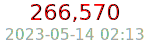

# The Matrix

This repository is [MyPDNS](https://mypdns.org/explore)'s self maintained
list of domains that need to be blocked for various reasons.

## TOC
- [The Matrix](#the-matrix)
  - [TOC](#toc)
- [Source list](#source-list)
- [Categorizing](#categorizing)
- [Submitting](#submitting)
  - [Reporting tool](#reporting-tool)
  - [File structure and Category explained](#file-structure-and-category-explained)
  - [Issue templates Quick links](#issue-templates-quick-links)
  - [The Matrix](#the-matrix-1)
- [Whitelist](#whitelist)
- [Bulk commits](#bulk-commits)
- [FAQ](#faq)
  - [Official mirrors](#official-mirrors)
- [Keywords](#keywords)

# Source list
The `source` folder contains several sub-folders, each named as groups,
for which a submission should be put. This however doesn't necessary
mean that one domain can't be put into several 'groups'.

Ex. `google.*` which belongs to several groups as they represent all
online evil, when we talk about privacy and anti-brainwashing/manipulation;
Facebook is also well represented in several categories.

# Categorizing
Each sub-folder of `sources` should contain its own README which in
short describes what the list is all about and the criteria to add a domain
into it's `domain.list` or `wildcard.list`.

# Submitting
## Reporting tool
You can also use our new [MyPDNS Reporter][mypdnsReport], which is one of
four things, a Browser-based add-on, API, CLI (Command LIne
Interface) and a website for which you can choose between as you prefer.

## File structure and Category explained

This list is on hold in relation to [API's cat values](tools/guide_api.md):

| Category                               | description                                                                                                                                                                                                                                                                                                                                                                                       |
| -------------------------------------- | ------------------------------------------------------------------------------------------------------------------------------------------------------------------------------------------------------------------------------------------------------------------------------------------------------------------------------------------------------------------------------------------------- |
| ~AdWare, adv                           | All about advertising: This includes sites offering banners and banner creation as well as sites delivering banners to be shown in webpages. Advertising companies are listed, too.   Everything related with ads. It is domain that server ads and sell ads / adware                                                                                                                          |
| ~"Bait Site"                           | An attempt to generate a list of sites that's uses baits like youtube to harvest peoples organs                                                                                                                                                                                                                                                                                                   |
| ~CryptoMiner / Coinblocker             | bitCoin miners                                                                                                                                                                                                                                                                                                                                                                                    |
| ~"DNS Server"                          | A mix of unwanted DNS servers that as example harvest domains, redirects queries into malicious domains                                                                                                                                                                                                                                                                                           |
| ~Drugs                                 | Sites offering drugs or explain how to make drugs (legal and non legal). Covers tobacco as well as viagra and similar substances.                                                                                                                                                                                                                                                                 |
| ~Gambling                              | Sites offering the possibility to win money. Poker, Casino, Bingo and other chance games as well as betting sites. Differs from -> hobby/games in the aspect of winning or loosing money or being lured to do so.                                                                                                                                                                                 |
| IP::BlackListing / IP Network blocking | A bit special category as it is in reverse. An IP/CIDR in notation is `in.arpa.` format where 24.0.2.0.192.rpz-x < Reason >                                                                                                                                                                                                                                                                       |
| ~Malicious / malware                   | [malicious](https://0xacab.org/my-privacy-dns/support/-/wikis/malicious) domain-ip- urls hosting malicious software, scripts, code etc.                                                                                                                                                                                                                                                           |
| ~Movies / streaming                    | Sites offering cinema programs, information about movies and actors. Sites for downloading video clips/movies (as long it is legal) are included as well.                                                                                                                                                                                                                                         |
| ~News                                  | Fake- + News Rather self explained, the biggest challenge is the BIAS of those who ads records to this cat.                                                                                                                                                                                                                                                                                       |
| ~Phishing                              | See [phishing](https://0xacab.org/my-privacy-dns/support/-/wikis/phishing)                                                                                                                                                                                                                                                                                                                        |
| ~Pirated Domains / Sharked             | Domains that is held hostage to be sold at overprices                                                                                                                                                                                                                                                                                                                                             |
| ~Politics                              | Sites of political parties, political organisations and associations; sites with political discussions.                                                                                                                                                                                                                                                                                           |
| Pornography (Adult 18+) (porno-sites)  | ~"NSFW::Gore" / ~"NSFW::Porn" / ~"NSFW::Snuff" / ~"NSFW::Strict" Sites about all kinds of sexual content ranging from bare bosoms to hardcore porn and S/M. You can read more details in the specific README: [Porn Records](https://0xacab.org/my-privacy-dns/matrix/-/blob/master/source/porn_filters/README.md)                                                                                |
| ~Redirector / Url Shortener            | Sites that actively help to bypass url filters by accepting urls via web form and play a proxying and redirecting role.    Domains that can be used to shorten long URLs. The original (long) URL will be accessed after the the short URL has been requested from the shortener. This distinguishes this category from redirector where the original URL is never accessed directly.       |
| ~Religion                              | Sites with religious content: all kind of churches, sects, religious interpretations and so on.                                                                                                                                                                                                                                                                                                   |
| ~Scamming                              | [scamming](https://0xacab.org/my-privacy-dns/support/-/wikis/scamming)                                                                                                                                                                                                                                                                                                                            |
| ~Spyware                               | Sites that tries to actively try to install software (or lure the user in doing so) in order to spy the surfing behaviour (or worse). This category includes trojan and phishing sites. The homecalling site where the collecting information is sent are listed, too.                                                                                                                            |
| ~Suspected                             | Domains and URLs that looks suspicious and on a watch list. False Positives should be expected. Grey-listed / testing the effect off blacklisting                                                                                                                                                                                                                                                 |
| ~Tracking domains                      | Site keeping an eye on where you surf and what you do in a passive. Covers web bugs, counters and other tracking mechanism in web pages that do not interfere with the local computer yet collecting information about the surfing person for later analysis. Sites actively spying out the surfer by installing software or calling home sites are not covered with tracker but with -> spyware. |
| ~Typo_Squatting                        | [typosquatting](https://0xacab.org/my-privacy-dns/support/-/wikis/typosquatting)                                                                                                                                                                                                                                                                                                                  |
| ~Weapons                               | Sites offering all kinds of weapons or accessories for weapons: Firearms, knifes, swords, bows,... . Armory shops are included as well as sites holding general information about arms (manufacturing, usage).                                                                                                                                                                                    |
| ~WhiteList                             | [whitelist](https://0xacab.org/my-privacy-dns/support/-/wikis/whitelist)                                                                                                                                                                                                                                                                                                                          |

## Issue templates Quick links
You can use the following quick links to generate issues within matrix

| <h2>Category</h2>                                                                                                                                        | <h2>Raw url code</h2>                                                                         |
| :------------------------------------------------------------------------------------------------------------------------------------------------------- | :-------------------------------------------------------------------------------------------- |
| [AdWare][AdWare]                                                                                                                                         | `https://0xacab.org/my-privacy-dns/matrix/-/issues/new?issuable_template=AdWare`              |
| Bait sites                                                                                                                                               |                                                                                               |
| [Crypto Miners][CryptoMiners]                                                                                                                            | `https://0xacab.org/my-privacy-dns/matrix/-/issues/new?issuable_template=CryptoMiner`         |
| [DNS Server][DNS-Server]                                                                                                                                 | `https://0xacab.org/my-privacy-dns/matrix/-/issues/new?issuable_template=DNS%20Server`        |
| Drugs                                                                                                                                                    |                                                                                               |
| [Gambling][Gambling]                                                                                                                                     | `https://0xacab.org/my-privacy-dns/matrix/-/issues/new?issuable_template=Gambling`            |
| [IP Blocking][IP-Blocking]                                                                                                                               | `https://0xacab.org/my-privacy-dns/matrix/-/issues/new?issuable_template=IP%20Blocking`       |
| [Malicious/MalWare][MalWare]                                                                                                                             | `https://0xacab.org/my-privacy-dns/matrix/-/issues/new?issuable_template=Malicious%20MalWare` |
| movies / streaming                                                                                                                                       |                                                                                               |
| News                                                                                                                                                     |                                                                                               |
| [Phishing][Phishing]                                                                                                                                     | `https://0xacab.org/my-privacy-dns/matrix/-/issues/new?issuable_template=Phishing`            |
| [Pirated Domain][PiratedDomain]                                                                                                                          | `https://0xacab.org/my-privacy-dns/matrix/-/issues/new?issuable_template=Pirated%20Domain`    |
| Politics                                                                                                                                                 |                                                                                               |
| [Redirecting][Redirecting] (uri shortener)                                                                                                               | `https://0xacab.org/my-privacy-dns/matrix/-/issues/new?issuable_template=Redirecting`         |
| Religion                                                                                                                                                 |                                                                                               |
| [Removal][Removal] Read the F.A.Q. *BEFORE* you proceed!                                                                                                 | `https://0xacab.org/my-privacy-dns/matrix/-/issues/new?issuable_template=Removal`             |
| [Scamming][Scamming] *Upcoming* (In development)                                                                                                         | `https://0xacab.org/my-privacy-dns/matrix/-/issues/new?issuable_template=Scamming`            |
| [Spam][Spam]                                                                                                                                             | `https://0xacab.org/my-privacy-dns/matrix/-/issues/new?issuable_template=Spam`                |
| [Spyware][Spyware]                                                                                                                                       | `https://0xacab.org/my-privacy-dns/matrix/-/issues/new?issuable_template=Spyware`             |
| Suspected                                                                                                                                                |
| [Tracking][Tracking]                                                                                                                                     | `https://0xacab.org/my-privacy-dns/matrix/-/issues/new?issuable_template=Tracking`            |
| [Typo Squatting][TypoSquatting]                                                                                                                          | `https://0xacab.org/my-privacy-dns/matrix/-/issues/new?issuable_template=Typo%20Squatting`    |
| Weapons                                                                                                                                                  |                                                                                               |
| [Whitelist][Whitelist]                                                                                                                                   | `https://0xacab.org/my-privacy-dns/matrix/-/issues/new?issuable_template=Whitelist`           |
| [False Negatives/Removals][Removals]                                                                                                                     | `https://0xacab.org/my-privacy-dns/matrix/-/issues/new?issuable_template=False%20Positive`    |
|                                                                                                                                                          |                                                                                               |
| <h2>Special Templates</h2>                                                                                                                               |                                                                                               |
| [-aa][Bulk-commits]   A fast bulk template modified constantly to match a specific case                                                               | `https://0xacab.org/my-privacy-dns/matrix/-/issues/new?issuable_template=-aa`                 |
| [getadmiral][]  A Template to ensuring the needed data while committing [getadmiral].com treats to make them connected and optimize the reaction data | `https://0xacab.org/my-privacy-dns/matrix/-/issues/new?issuable_template=getadmiral`          |

## The Matrix
For the Adult filtering, please refer to the [README](source/README.md)

**Intro**: The difference between files inside `source/category_name` is
that, with [RPZ][RPZ] We do not nessesarily need to apply any found
subdomain records, as wildcard is recognized as a valid blacklist record.
This allow us to use only two types of record sheets `wildcard.list` and
`domain.list`, this is also the explanation for why you haven't seen a 
hosts file within our source list.  
So to use hour records with a non [RPZ][RPZ] reconizing system such as Pi-
hole and `/etc/hosts` or for spydoze 
`%SystemRoot%\System32\drivers\etc\hosts`, you would need to combine both
the `wildcard.list` and `domain.list`.

Alternatively you can use our automatically combined weekly updated
[hosts-list][hosts-list]

# Whitelist
This list has its own life, as it's a very, very tricky one to
maintain.

The reason for that is, it has to balance between what is going on with
a domain that, for several reasons, might be blacklisted on some lists
but not on others. It can also be that a domain in general is 99,9%
right, but because of its nature of user based submissions, could do a
lot of evil.

Ex. Github.com

Gitlab is hosting 100% user submitted content, but for the same reason,
is also a target for cyber criminals to host their evil
[Malware](https://en.wikipedia.org/wiki/Malware). For that reason, Gitlab
often pops up on lists for malicious code. But as that would have a huge
influence on our workflow, it would, of course, have to be whitelisted on
our list.

# Bulk commits
Bulk commits will only be tolerated, if done by a @developer of the
repository, does it and **_ONLY_** if and when the source is commonly
trusted **_and_** if the amount of domains can justify it will be way too
time consuming to open an issue for each domain changed in the targeted
lists.

**note**: This rule shall always be a copy of the common
[Bulk commits][Bulk-commits] rule.

# FAQ
**Q**: Your lists have broken my website, by blocking a third party
domain!

**A**: We have absolutely not broken your website by blocking any
third-party domain.
It's you and only you who has submitted bad code and mis-written your
website to behave badly. Be happy we haven't blocked your website
already for leaking privacy to third party.

**Q**: Why don't you whitelist example.com?

**A**:

1) It's up to individual users (i.e. you) to create and maintain their own
   whitelist.

2) By whitelisting bad domain X because website Y uses bad domain X,
   we're deceiving our users who believe they're protected against bad
   domain X.

3) Through this repository's issue board, we're trying our best to give
   people the right information for them to decide whether they
   should allow access to some domains, despite them being marked as bad.

## Official mirrors

The following repositories are official mirrors and should (when things
goes right) be updated by [push on commit][poc]

| Project         | Host                                                       | Metode (push \| pull) |
| :-------------- | :--------------------------------------------------------- | --------------------: |
| Adblocker Rules | `https://git.disroot.org/my-privacy-dns/adblocker-rules`   |                  push |
| Adblocker Rules | `https://git.kescher.at/my-privacy-dns/adblocker-rules`    |                  pull |
| Adblocker Rules | `https://gitea.slowb.ro/spirillen/adblocker-rules`         |                  pull |
| Adblocker Rules | `https://github.com/mypdns/adblocker-rules`                |                  push |
| Adblocker Rules | `https://gitlab.com/my-privacy-dns/matrix/adblocker-rules` |                  push |
| Adblocker Rules | `https://notabug.org/my-privacy-dns/adblocker-rules`       |                  pull |
| ============    | =====================================================      |      ================ |
| Matrix          | `https://git.disroot.org/my-privacy-dns/matrix`            |                  push |
| Matrix          | `https://gitea.slowb.ro/spirillen/matrix`                  |                  push |
| Matrix          | `https://github.com/mypdns/matrix`                         |                  push |
| Matrix          | `https://gitlab.com/my-privacy-dns/matrix/matrix`          |                  push |
| Matrix          | `https://notabug.org/my-privacy-dns/matrix`                |                  pull |

[AdWare]: https://0xacab.org/my-privacy-dns/matrix/-/issues/new?issuable_template=AdWare "Issue template to commit adserver domains"
[Bulk-commits]: https://0xacab.org/my-privacy-dns/support/-/wikis/Contributing#bulk-commits
[CryptoMiners]: https://0xacab.org/my-privacy-dns/matrix/-/issues/new?issuable_template=CryptoMiner "Issue template to commit Crypto miners"
[DNS-Server]: https://0xacab.org/my-privacy-dns/matrix/-/issues/new?issuable_template=DNS%20Server "Issue template to commit For blacklisting at the DNS level"
[EasyList]: https://github.com/easylist/easylist/
[Gambling]: https://0xacab.org/my-privacy-dns/matrix/-/issues/new?issuable_template=Gambling "Issue template to commit Gambling site"
[getadmiral]: https://0xacab.org/my-privacy-dns/matrix/-/issues/3023
[IP-Blocking]: https://0xacab.org/my-privacy-dns/matrix/-/issues/new?issuable_template=IP%20Blocking "Issue template to commit Blocking by IP addresses"
[MalWare]: https://0xacab.org/my-privacy-dns/matrix/-/issues/new?issuable_template=Malicious%20MalWare "Issue template to commit Malicious and or Malware"
[mypdnsReport]: https://0xacab.org/my-privacy-dns/matrix/-/blob/master/tools/README.md
[Phishing]: https://0xacab.org/my-privacy-dns/matrix/-/issues/new?issuable_template=Phishing "Issue template to commit Phishing"
[PiratedDomain]: https://0xacab.org/my-privacy-dns/matrix/-/issues/new?issuable_template=Pirated%20Domain "Issue template to commit Outdated domain, pirated and hijacked by domains Jackal's"
[Redirecting]: https://0xacab.org/my-privacy-dns/matrix/-/issues/new?issuable_template=Redirecting "Issue template to commit URL shortening and other redirecting only domain"
[Removal]: #faq "Read the F.A.Q. *BEFORE* you proceed!"
[Removals]: https://0xacab.org/my-privacy-dns/matrix/-/issues/new?issuable_template=False%20Positive "False Positive or removal of domains"
[Scamming]: https://0xacab.org/my-privacy-dns/matrix/-/issues/new?issuable_template=Scamming "Issue template to commit Scamming sites"
[Spam]: https://0xacab.org/my-privacy-dns/matrix/-/issues/new?issuable_template=Spam "Issue template to commit Spam records"
[Spyware]: https://0xacab.org/my-privacy-dns/matrix/-/issues/new?issuable_template=Spyware "Issue template to commit Spyware domains"
[Tracking]: https://0xacab.org/my-privacy-dns/matrix/-/issues/new?issuable_template=Tracking "Issue template to commit Tracking records"
[TypoSquatting]: https://0xacab.org/my-privacy-dns/matrix/-/issues/new?issuable_template=Typo%20Squatting "Issue template to commit Typo Squatting"
[Whitelist]: https://0xacab.org/my-privacy-dns/matrix/-/issues/new?issuable_template=Whitelist
[RPZ]: https://0xacab.org/my-privacy-dns/support/-/wikis/RPZ "Response Policy Zone"
[hosts-list]: https://0xacab.org/my-privacy-dns/hosts/-/tree/master/download "Hosts foratted blacklists"

# Keywords
A few keywords for this project is Enhanced Privacy, DNS Firewall,
Privacy First
