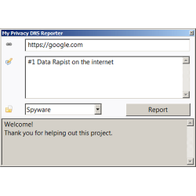
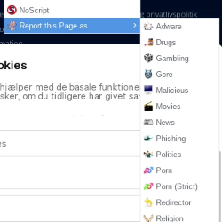
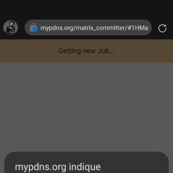

This is an easy way to commit `new websites` to [Matrix Issues](../).


From the time you have committed a domain / uri you can see it as a
committed issue is depending on the current queue for handling of your
request, [the server](http://crimeflare.eu.org) then process and
validating your contribution towards some simple rules like below and
then issue will be created.

- Is the website _online_?
- Is the domain _not listed in files_?
- Is the _issue_ not exist?
- Is the domain _not parked_?
- Is the _screenshot_ ready?

Process flow: `Taking the screenshot`, `Reading the website`,
`Checking DNS` and `Searching for existing issues within mypdns.org` for
_each_ request cost some time.  
Because of this your requests might take several hours depending on
current wait-in-line status.  
You will find your issue later on your To-do list.

```
Android mentioned you on issue #XXX "example.com" at My Privacy DNS
```

- By using this service you agree to our [Privacy Policy](privacy_policy.md).


## Clients

| CLI | GUI | Add-ons | Website |
| -- | -- | -- | -- |
| [](client_cli.md) | [](client_gui.md) | [](client_addon.md) | [](client_web.md) |

## For Developers

- [Basic API Guide](guide_api.md)
- [Advanced API Guide](guide_apiadv.md)

--------

#### TOC

- [Control your issue](#control-your-issue)
  - [Access Level](#access-level)
  - [All users](#all-users)
  - [Super users ONLY](#super-users-only)

------

## Control your issue

You can close, reopen, or rescan your issue created **by you**.
Just write a comment in issue and it will be handled quickly.
You cannot control other user's issue _except_  Superusers.


### Access Level

_Superuser_ is a person who have Maintainer access to this repository. They can edit files and issues directly. To become a Superuser ask for permission whoever owns Matrix project.

_Banned user_ is a person who got banned (prohibited) from using this Reporter service. Chances are you pushed too many bogus reports and fail to reply for very long time. Such users can be found in [ban.txt](../.assets/reporter/ban.txt). To unban a person, edit the file and the bot will retrieve it within an hour.


### All users

| Comment                                                          | Result                        |
| ---------------------------------------------------------------- | ----------------------------- |
| `@matrix /close`                                               | Close this issue.             |
| `@matrix /reopen`                                              | Reopen this issue.            |
| `@matrix /update URL`<br>`@matrix /update` (=`/update this`) | Update the issue description. |


### Superusers ONLY

| Comment                                                                                        | Result                                                                                                                                             |
| ---------------------------------------------------------------------------------------------- | -------------------------------------------------------------------------------------------------------------------------------------------------- |
| `@matrix /wontfix`                                                                           | Set `Wontfix` label & close the issue.<br>(same as `/label Wontfix` + `/close`)                                                                    |
| `@matrix /label LABEL`                                                                       | Set `LABEL` label. Comma-separated, Case-Sensitive.<br>e.g. `/label Linked,Tracking`                                                               |
| `@matrix /change category URL`<br>`@matrix /change category`<br>(=`/change category this`) | Change the category and update the issue with a new issue format.                                                                                  |
| `@matrix /pirated`                                                                           | (same to `/change Pirated`)                                                                                                 |
| `@matrix /include category URL`<br>`@matrix /include guess URL` | Add/Update new subdomain to exisiting issue.<br>The "_guess_" category will use the primary reported category.                                                                                  |
| `@matrix /ss`                                           | Add `Need::Screenshot` label.                                          |
| `@matrix /translate URL`<br>`@matrix /translate` (=`/translate this`)                                           | Translate the website into English.                                          |
| `@matrix /investigate`                                           | Investigate the issue domain.                                       |
| `@matrix /crawl` | Download & analyze reported website for links. |
| `@matrix /commit`<br>`@matrix /ok`                                                         | Commit this issue                                                                                                                                  |
| `@matrix /csam` | Turn on confidential,<br>Remove screenshot,<br>Add CSAM label,<br>and Commit the issue. |
| `@matrix /delete` | Delete this domain (and its subdomains) from all existing lists. |
| `@matrix /destroy` | Delete(Destroy) the issue. BE CAREFUL!! |


You can remove the first `/`. For example `@matrix close` is identical
to `@matrix /close`.

If the command is not actionable the bot will add `!` as reaction.


> **About `this` URL**
- If you are going to update or change current issue _with same URL_, you 
  can write `this` for URL.
  - This does not work with issues which does not include the URL 
    inside the description. (very old issue or user-created issue)

> **About `/update URL`**
- The URL's base domain must match the title's domain.
  - e.g. `@matrix /update https://blog.example.com` for updating
    `example.com` issue
- You can also write
    ```
    @matrix /update https://blog.example.com/blog/
    ```
  (The \` will be ignored automatically)

> **About `/change category URL`**
- The `category` value is [listed here](guide_api.md#the-cat-value) - pick either `Category`(recommend) or `Case-sensitive format`
- For example if you want to resubmit `Porn` issue as `NSFW::Strict`, 
  you will write `@matrix /change pornstrict https://www.example.com`.
